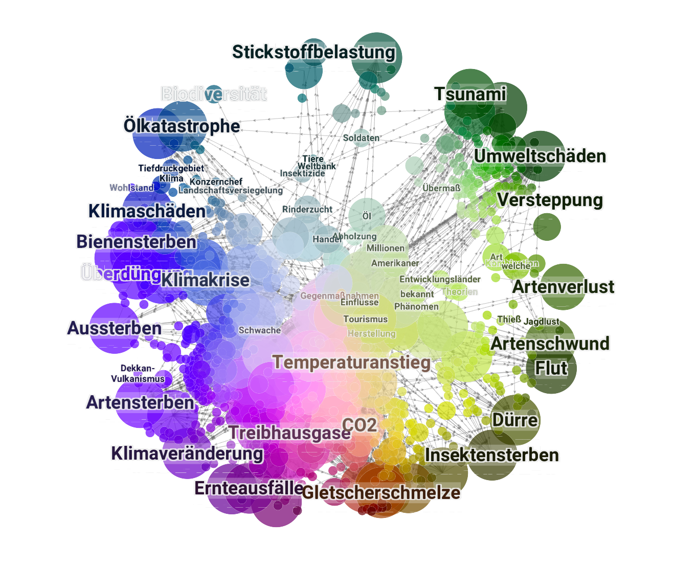

# DataNetworkGraph

`DataNetworkGraph` is an extension of [DataMapPlot](https://github.com/TutteInstitute/datamapplot), a Python library designed to create beautiful visualizations of data maps. While the original `DataMapPlot` focuses on generating static and interactive *scatter plots* of data maps, `DataNetworkGraph` extends this functionality by transforming data maps into **interactive network graphs**.

The primary goal of `DataNetworkGraph` is to enable the visualization of relationships and connections within your data map, representing clusters as nodes and defined relationships as edges. This allows for a richer understanding of the underlying structure and interactions within your high-dimensional data, presented with the same focus on aesthetic quality as the original `DataMapPlot`.


## Primary Additions and Features

`DataNetworkGraph` introduces key modifications and features to facilitate network graph visualization:

* **Network Graph Visualization:** Transforms data map coordinates into nodes in an interactive network graph.
* **Edge Integration:** Allows the definition and visualization of edges between nodes (clusters or data points) based on user-provided relationships.
* **Node Prioritization:** Enables setting priorities for nodes, influencing their visual representation within the graph.
* **Interactive Network Plots:** Extends the interactive plotting capabilities to include network elements, offering dynamic exploration of connections.

## Basic Usage

`DataNetworkGraph` maintains a similar API to `DataMapPlot`, primarily extending the `create_interactive_plot` function.

To leverage `DataNetworkGraph`, you will primarily work with `data_map_coords` and `labels` as with the original library, but now with additional parameters to define your network structure: `edge_dataframe`, `node_connections`, and `node_indices`.

A basic example for creating an interactive network graph might look something like:

```python
import datamapplot # You will use `datamapplot` here, which will be DataNetworkGraph after installation

# Assume you have:
# data_map_coords (Nx2 array of data map coordinates)
# labels (N array/list of cluster labels)
# edge_dataframe (pandas DataFrame defining edges, e.g., 'source', 'target', 'weight')
# node_connections (representation of node connectivity)
# node_indices (indices of nodes in the data map)
# priority (optional array for node priority)

# Note: The exact usage of edge_dataframe, node_connections, and node_indices
# will be detailed in the full documentation.

datamapplot.create_interactive_plot(
    data_map_coords,
    labels,
    edge_dataframe=edge_dataframe,
    node_connections=node_connections,
    node_indices=node_indices,
    priority=priority, # optional
    **style_keywords # Other datamapplot styling options
)
````

**Please refer to the [original DataMapPlot documentation](https://datamapplot.readthedocs.io/) for detailed information on general usage of `create_plot`, `create_interactive_plot`, and other plotting options that are still relevant to `DataNetworkGraph`.**

## Installation

`DataNetworkGraph` shares core dependencies with `DataMapPlot`.

The installation method for `DataNetworkGraph` will be provided here once it's packaged.
In the meantime, you can install the required dependencies:

  * Numpy
  * Matplotlib
  * Scikit-learn
  * Pandas
  * Datashader
  * Scikit-image
  * Numba
  * Requests
  * Jinja2

You can typically install these using pip:

```bash
pip install numpy matplotlib scikit-learn pandas datashader scikit-image numba requests jinja2
```

## License

`DataNetworkGraph` is MIT licensed, inheriting from the original [DataMapPlot project](https://github.com/TutteInstitute/datamapplot). See the LICENSE file for details.

## Help and Support

For general help and support regarding the base `DataMapPlot` functionalities, please refer to the `DataMapPlot`'s [Read the Docs documentation](https://datamapplot.readthedocs.io/) and their [issue tracker](https://github.com/TutteInstitute/datamapplot/issues).

For issues or questions specifically related to the network graph extensions in `DataNetworkGraph`, please [open an issue](https://www.google.com/search?q=https://github.com/norygami/DataNetworkGraph/issues/new) in this repository.

## Contributing

Contributions to `DataNetworkGraph` are welcome\! If you have ideas for features, improvements, or examples related to network graph visualization on data maps, please get in touch. To contribute, please fork this project, make your changes, and submit a pull request.

**We extend our sincere gratitude to the developers of [DataMapPlot](https://github.com/TutteInstitute/datamapplot) for creating the foundational library upon which `DataNetworkGraph` is built.**

-----

**Original `DataMapPlot` information (for context):**

  * **Original Repository:** [https://github.com/TutteInstitute/datamapplot](https://github.com/TutteInstitute/datamapplot)
  * **Original Documentation:** [https://datamapplot.readthedocs.io/](https://datamapplot.readthedocs.io/)
